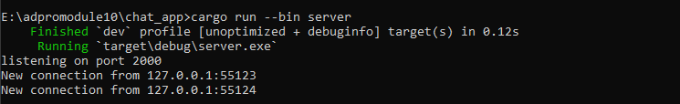
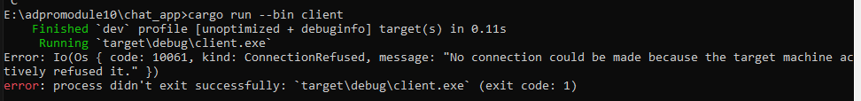
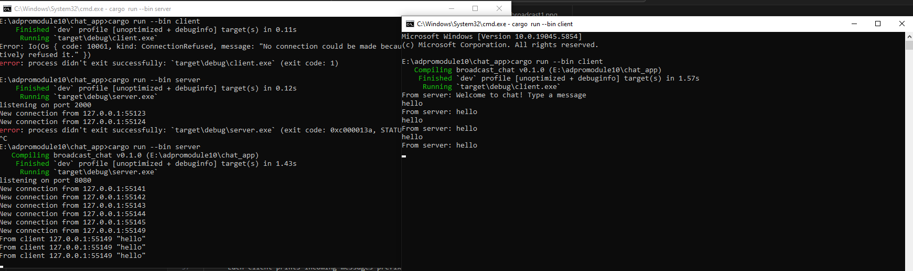
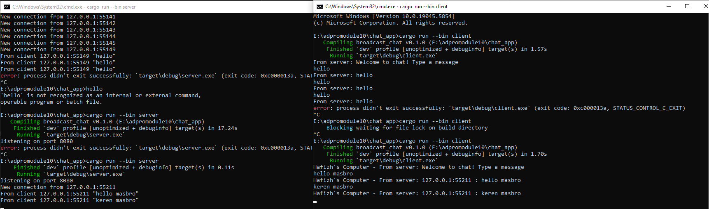

# Module 10

Hafizh Surya Mustafa Zen 2306256343


##  How to run

1. **Build the project**

   ```sh
   cargo build 
   ```

2. **Start the server**

   ```sh
   cargo run --bin server
   ```

   This will bind to `127.0.0.1:2000` and wait for incoming client connections.

3. **Start three clients**
   In *three* separate terminals, run:

   ```sh
   cargo run --bin client
   ```

   Each client will connect to the server on port 2000.

4. **Chat!**

    * Type a message in *any* client and press Enter.
    * The server logs the raw message it received and then broadcasts it back to *all* connected clients.
    * Each client prints incoming messages prefixed with `From server:`.

---

##  Demo




<h2>2.2 Modifying the WebSocket Port</h2>

<h3>1. Where to Modify</h3>

<ul>
  <li><strong>Server</strong> (<code>server/src/main.rs</code>):</li>
</ul>
<pre><code class="language-diff">
- let listener = TcpListener::bind("127.0.0.1:2000").await?;
+ let listener = TcpListener::bind("127.0.0.1:8080").await?;
</code></pre>

<ul>
  <li><strong>Client</strong> (<code>client/src/main.rs</code>):</li>
</ul>
<pre><code class="language-diff">
- let socket = TcpStream::connect("127.0.0.1:2000").await?;
+ let socket = TcpStream::connect("127.0.0.1:8080").await?;
</code></pre>

<p>There are no other port references—this is raw TCP with newline-delimited UTF-8, not HTTP or WebSocket.</p>

<h3>2. Expected Behavior When Mismatched</h3>

<p>If one side still uses port 2000 and the other uses port 8080, clients will immediately see:</p>

<pre><code>
Connection refused (os error 10061)
</code></pre>

<p>because nothing is listening on the target port.</p>

<h3>3. Testing on Port 8080</h3>

<ol>
  <li>Rebuild and start the server:</li>
</ol>
<pre><code class="language-bash">
cargo run --bin server
</code></pre>

<p>You should see:</p>
<pre><code>
listening on port 8080
New connection from 127.0.0.1:xxxxx
From client 127.0.0.1:xxxxx: "hello"
</code></pre>

<ol start="2">
  <li>In separate terminals, run each client:</li>
</ol>
<pre><code class="language-bash">
cargo run --bin client
</code></pre>

<ol start="3">
  <li>Type messages—each client should receive:</li>
</ol>
<pre><code>
From server: &lt;your message&gt;
</code></pre>

<h3>4. Demo (Port 8080)</h3>

<p></p>


<h2>Small Update: Displaying Sender Information on Clients</h2>

<p>To help identify who sent each message, we’re adding the sender’s IP and port to each broadcasted message. Since we haven’t implemented usernames yet, this is a simple way to show who sent what. Additionally, each client will now display a label like a hostname for clarity when viewing multiple client terminals.</p>

<h3>1. What and Where to Modify</h3>

<ul>
  <li><strong>Server</strong> (<code>server/src/main.rs</code>):<br>
  Update the broadcast line to include the client’s address:
  <pre><code class="language-diff">
- bcast_tx.send(text.clone())?;
+ bcast_tx.send(format!("{addr} : {text}"))?;
  </code></pre>
  </li>

  <li><strong>Client</strong> (<code>client/src/main.rs</code>):<br>
  Modify the receive loop to include a prefix for easier identification:
  <pre><code class="language-diff">
- println!("From server: {}", text);
+ println!("Brian's Computer - From server: {}", text);
  </code></pre>
  </li>
</ul>

<p>No other changes are needed. The app still uses raw TCP wrapped in WebSocket-style framing, and the messages remain newline-delimited UTF-8 text.</p>

<h3>2. Why Make These Changes?</h3>

<ul>
  <li><strong>Sender Address:</strong> Including the IP and port helps tell messages apart when multiple clients are active, especially without login or username features.</li>
  <li><strong>Client Identifier:</strong> Prefixing each message with a label like "Brian's Computer" simulates a hostname or identity, helping you know which terminal belongs to which client.</li>
</ul>

<h3>3. Demonstration</h3>

<p></p>

<p>In the screenshot above:</p>
<ul>
  <li>Each <strong>client</strong> prints something like:</li>
  <pre><code>Brian's Computer - From server: 127.0.0.1:56075 : halo</code></pre>

  <li>The <strong>server</strong> logs the incoming message with the client’s address:</li>
  <pre><code>From client 127.0.0.1:56075 "halo"</code></pre>
</ul>
